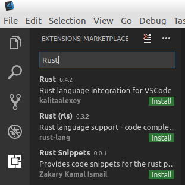
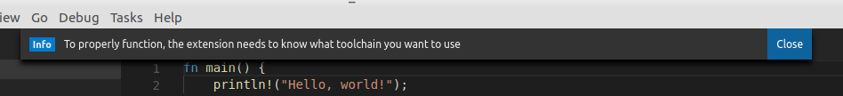
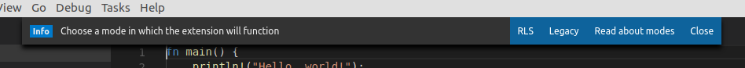
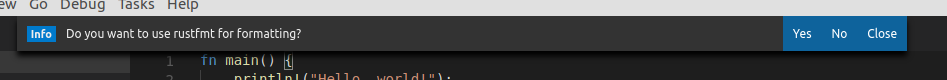

# Visual Studio Code

0. Install Rust RLS (OPTIONNAL, only install if you want to try it out)  
Alpha warning: RLS is unstable.
Follow instructions here: [RLS](https://github.com/rust-lang-nursery/rls).  
You shouldn't need to configure Racer as it has been done before.

1. Install Visual Studio Code:  
* Linux  
You can follow these instructions: [Install VSCode on Linux](https://code.visualstudio.com/docs/setup/linux)  

* Windows  
Go here: [Download VSCode](https://code.visualstudio.com/download)  

2. Install the rust plugin in VSCode:  
In the program, click on View (top bar) and then extensions.  
Search for `Rust`. Install the first extension, reload the program.  
  

3. Create a rust hello world:  
Simply execute those commands:  
```sh
mkdir ~/rust
cd ~/rust
cargo new hello_world --bin
```

4. Open your newly created project in VSCode:  
In VSCode, click on File (top bar), open a folder and open the `~/rust/hello_world` folder you just created.  
Open the `src/main.rs` file.  

5. The Rust VSCode plugin will ask you a series of questions:  
* For the first one (asking you what toolchain to use), click on close and then select `stable`.  
  

* It will then ask you for the mode you want to use, select the one you want. (see 0. for RLS install).  
Legacy is the more stable option BUT it only checks for errors on a save.
  

* (RLS ONLY) It will ask you again for the toolchain to use. You won't have another choice but to use the `nightly` this time.  
* (OPTIONNAL) The next question is if you want to use `rustfmt` for formatting.  
* (RustFmt ONLY) The best way to install it would be to go inside your console, do the following command: `cargo install rustfmt` and then click on yes (I had some issues on windows with the automatic install of Rust crates with VSCode).  
  

6. You are now ready to code!
Test everything out!
