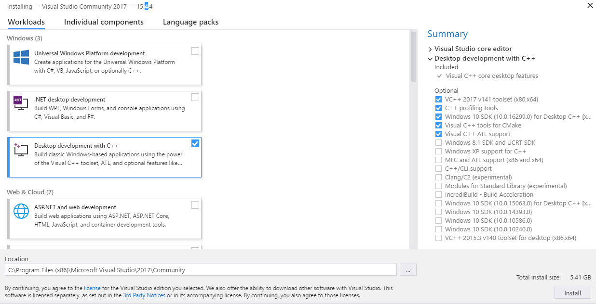
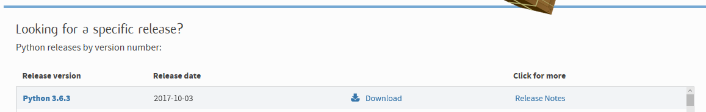
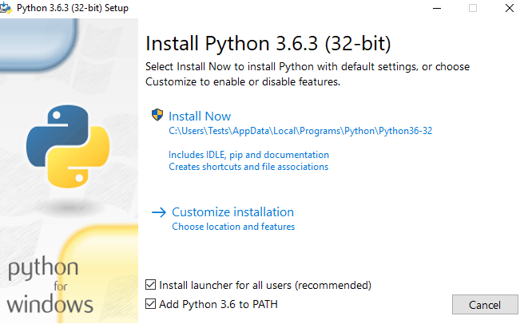
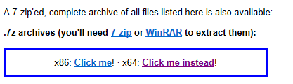

# Vim Setup

1. [Linux](#linux-ubuntu-based-distributions)
2. [Windows](#windows-10)

0. install Rust RLS (this step is valid for Windows and Linux)  
Follow instructions here: [RLS](https://github.com/rust-lang-nursery/rls#setup).  
You shouldn't need to configure Racer as it has been done before.

## Linux (Ubuntu based dstributions)

1. Install Python 3: (or use the python version you already have)  
```sh
sudo apt install python3
```

2. Install Vim 8:  
Vim 8 is essential for async support! You can choose to use the slow Syntastic but it won't be as good of an experience.  
Check the version of vim available on your distribution first. Here, for Ubuntu:  
```sh
sudo apt search ^vim$
```
The version reported for me is 7.4. Let's install the correct repo for Vim8:  
```sh
sudo add-apt-repository ppa:jonathonf/vim
```

Then to install:  
```sh
sudo apt update
sudo apt install vim
```

3. Install the plugin manager of your choice:  
We will use [Vim-Plug](https://github.com/junegunn/vim-plug) for the vimrc example.  
Use the instructions provided on the github page to install the plugin manager.  

4. Create the correct vimrc file:  
(the rust toolchain location can be found with this command: `rustc --print sysroot`)  
The vimrc file on linux should be in `~/.vimrc`
```vim
call plug#begin()

Plug 'valloric/youcompleteme'
Plug 'w0rp/ale'

call plug#end()

" This line is optionnal if your RUST_SRC_PATH variable is valid
let g:ycm_rust_src_path="/home/luxed/.rustup/toolchains/stable-x86_64-unknown-linux-gnu/lib/rustlib/src/rust/src"

let g:ale_linters = {'rust': ['rls']}
```

Execute the following commands in Vim: `:source %` and then `:PlugInstall`

5. Setting up youcompleteme for rust syntax:  
Go into the following directory: `~/.vim/plugged/youcompleteme`  
And execute the following command: `./install.py --rust-completer` (you might need to install `CMake`, `g++` and `python-dev` for this to work)  

6. You're done ! everything works ! (I hope)

## Windows 10

When you see commands to type, use `PowerShell`.  

0. Download and install Visual Studio 2013 or higher
Download [here](https://www.visualstudio.com/), select `Community YEAR` under `Download for Windows`  
Select this option:  
  
(Installation is 5G so it take some time and will depend on your connection)

1. Download and install python:  
[Python Download page](https://www.python.org/downloads).  
In the release section, click on `Download` for the last version (top).  
  
Now go at the bottom of the page and download the following:  
  
Select the "Add to python checkbox at the bottom of the install"  
  

For the purpose of this tutorial, Python will be installed in `C:\Python\Python\Python36`  

2. Download GVim8 already compiled with python support:  
This step is really important for plugins to work.  
Go to the link here: [GVim](https://tuxproject.de/projects/vim/) and extract where you want (you may need [7zip](http://www.7-zip.org/))  


3. Install the plugin manager of your choice:  
We will use [Vim-Plug](https://github.com/junegunn/vim-plug) for the vimrc example. (you may need to install [git](https://git-scm.com/download))  
Use the instructions provided on the github page to install the plugin manager.  

4. Create the correct vimrc file:  
/!\ WARNING: `Ale` and `Syntastic` don't work on Windows for now. /!\
(the rust toolchain location can be found with this command: `rustc --print sysroot`)  
The Vimrc file on windows should be in `~\_vimrc`
```vim
set encoding=utf-8

call plug#begin()

Plug 'valloric/youcompleteme'
Plug 'w0rp/ale'

call plug#end()

let g:ale_linters = {'rust': ['rls']}
```

5. Setting up youcompleteme for rust syntax:  
Go into the following directory: `~\vimfiles\plugged\youcompleteme`  
And execute the following command: `.\install.py --rust-completer` (you might need to install [CMake](https://cmake.org/download/) for this to work)  

## Known Issues
* Error 404 when updating apt on Ubuntu 16.10:  
Simply force the xenial repo to be used. After adding the repo with `add-apt-repository`, you can edit the file found in `/etc/apt/sources.list.d/` that corresponds to the repo (it begins by `jonathonf`) and replace every occurence of `yakkety` (in this case) with `xenial`
